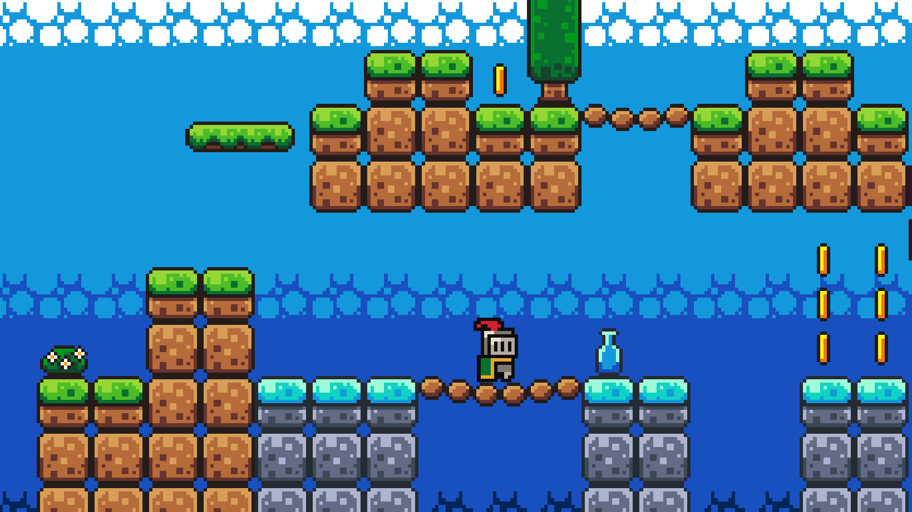
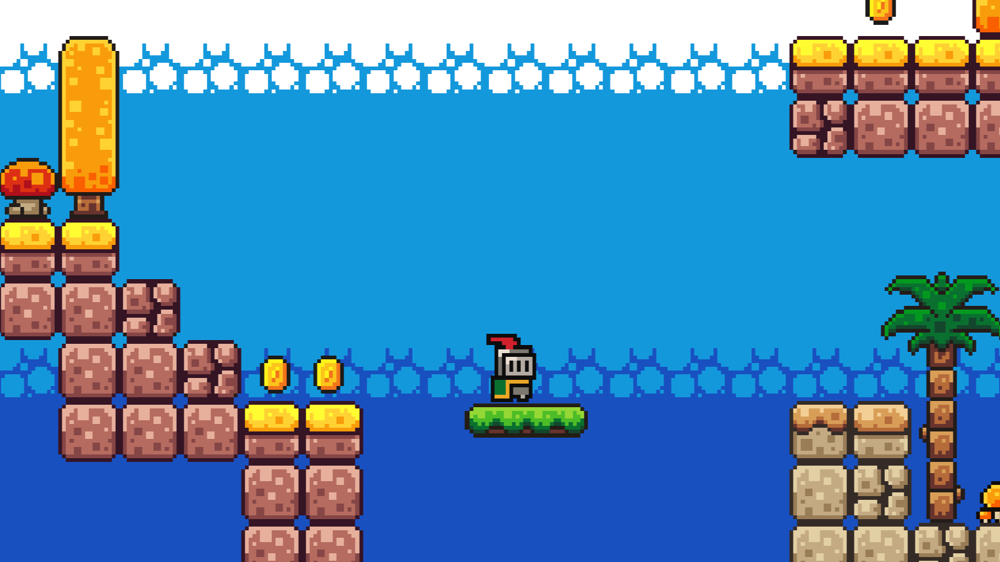

# First Game in Godot

A simple **2D platformer game** created as my first experience with the **Godot Engine** and **GDScript**.



## Overview

This project was created as my **first game development project with Godot**.

The game was developed by following the **"How to make a Video Game - Godot Beginner Tutorial"** by [Brackeys](https://www.youtube.com/watch?v=LOhfqjmasi0).

Through this project, I learned the fundamentals of 2D game development with Godot, including player movement, physics, collisions, scenes, enemies, collectibles, audio, and basic game management.

## Features

* 2D player movement
* Platform-based level
* Player jumping and movement
* Collectible coins
* Enemies
* Kill zones
* Player damage and death
* Sound effects
* Background music
* Multiple Godot scenes
* Basic game management

## Gameplay

The game features a simple platforming environment where the player controls a knight, navigates through platforms, collects coins, and avoids enemies and hazards.

### Controls

| Action     | Key       |
| ---------- | --------- |
| Move Left  | `A` / `←` |
| Move Right | `D` / `→` |
| Jump       | `Space`   |

## Technologies

* **Godot**
* **GDScript**

## What I Learned

This project helped me become familiar with the basic workflow of game development in Godot, including:

* Working with **Scenes and Nodes**
* Creating and organizing game objects
* Writing scripts using **GDScript**
* Implementing player movement and physics
* Working with collisions
* Using signals
* Creating enemies and interactive objects
* Managing audio and sound effects
* Organizing a multi-scene Godot project
* Building and exporting a Godot game

## Project Structure

```text
Godot-First-Game/
├── assets/
│   ├── fonts/
│   ├── music/
│   ├── sounds/
│   └── sprites/
├── scenes/
│   ├── coin.tscn
│   ├── game.tscn
│   ├── kill_zone.tscn
│   ├── music.tscn
│   ├── platform.tscn
│   ├── player.tscn
│   └── slime.tscn
├── scripts/
│   ├── coin.gd
│   ├── game_manager.gd
│   ├── kill_zone.gd
│   ├── player.gd
│   └── slime.gd
├── project.godot
└── export_presets.cfg
```

## Tutorial

This project was created by following:

**How to make a Video Game - Godot Beginner Tutorial**
by **Brackeys**

[Watch the tutorial on YouTube](https://www.youtube.com/watch?v=LOhfqjmasi0)

This project is intended as a learning project and my first hands-on experience with the Godot game engine.

```md

```

Computer Engineering Student
Iran University of Science and Technology
